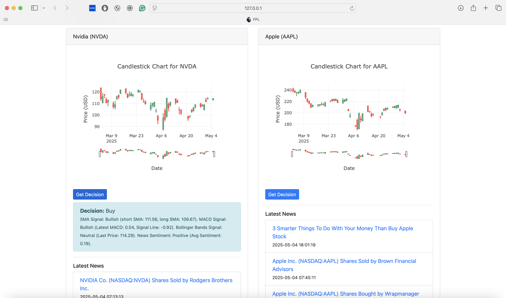

# STX-Terminal: AI-Powered Stock Tracking Portal

A personal, locally-hosted stock tracking portal with real-time data, interactive candlestick charts, integrated news sentiment, and a custom decision engine. This project was conceived and architected by me to provide a professional-grade trading dashboard tailored to individual needs.
STX-Terminal is a real-time stock tracking portal built for serious traders, enthusiasts, and self-hosted investors who want more than just graphs. It brings together:

- Live candlestick charts
- Real-time price polling
- News aggregation with sentiment analysis
- AI-driven Decision Engine that provides Buy/Hold/Sell calls

Designed and developed by Saurav Dhakal, this portal is powered by an original Decision Engine concept combining technical analysis with live market sentiment.

## Live Preview

### Dashboard


### Dashboard with Candlestick Charts


### AI Decision Output (API)


### News Sentiment & Feed


---

## Features

### Real-Time Candlestick Charts
- Interactive candlestick charts for NVDA, AAPL, TSLA, GOOGL, and INTC
- Automatically updates every minute using APScheduler
- Plotly.js powered frontend with smooth transitions

### Live News & Sentiment
- Pulls latest news articles via NewsAPI
- Analyzes tone using TextBlob
- Saves articles and sentiment scores to SQLite for tracking

### Decision Engine (Core Innovation)
A hybrid algorithmic model that fuses:
- Short-term & long-term SMA crossover strategy
- Aggregated news sentiment
- Outputs: Buy / Hold / Sell with plain-language rationale

This engine was fully conceptualized and implemented by the author as a way to simulate how professional advisors process market data.

### Real-Time Price Polling
- Displays live prices using yfinance
- Auto-refresh every second

---

## Tech Stack

| Layer          | Tools Used                                  |
|----------------|----------------------------------------------|
| Backend        | Python, Flask, SQLAlchemy, APScheduler      |
| Data Sources   | Yahoo Finance API (via yfinance), NewsAPI   |
| Frontend       | Plotly.js, Jinja, Vanilla JS                |
| Database       | SQLite (for offline and lightweight usage)  |

---

## Getting Started

### Requirements
- Python 3.8+
- Pip
- Internet connection (for APIs)

### 1. Clone and Install
```bash
git clone https://github.com/dhakalsaurav11/stx-terminal.git
cd stx-terminal
pip install -r requirements.txt
```

### 2. Set NewsAPI Key
Create a `.env` file in the root directory:
```env
NEWS_API_KEY=your_key_here
```

### 3. Run the App
```bash
python app.py
```

App will be live at `http://127.0.0.1:5000/`

---

## Decision API (Optional Integration)

To programmatically retrieve decision output:
```bash
GET /decision/<symbol>
```

Example:
```bash
curl http://127.0.0.1:5000/decision/AAPL
```

Returns:
```json
{
  "symbol": "AAPL",
  "short_sma": 222.3,
  "long_sma": 220.7,
  "technical_signal": "bullish",
  "avg_news_sentiment": 0.203,
  "news_signal": "positive",
  "recommendation": "Buy",
  "explanation": "Technical analysis indicates a bullish trend... News sentiment is positive."
}
```

---

## Scheduler

The portal uses APScheduler to:
- Fetch new stock data every 60 seconds
- Fetch latest news and sentiment every 5 minutes

This ensures that decisions stay fresh with minimal user involvement.

---

## Author's Note

This project started as a personal trading assistant and evolved into a powerful, modular tool. The decision engine is based on how a human trader thinks: blending charts with market news.

If you're building an automated trading AI or looking to expand this into a mobile/web SaaS, the foundations are already here.

Built from scratch by Saurav Dhakal

